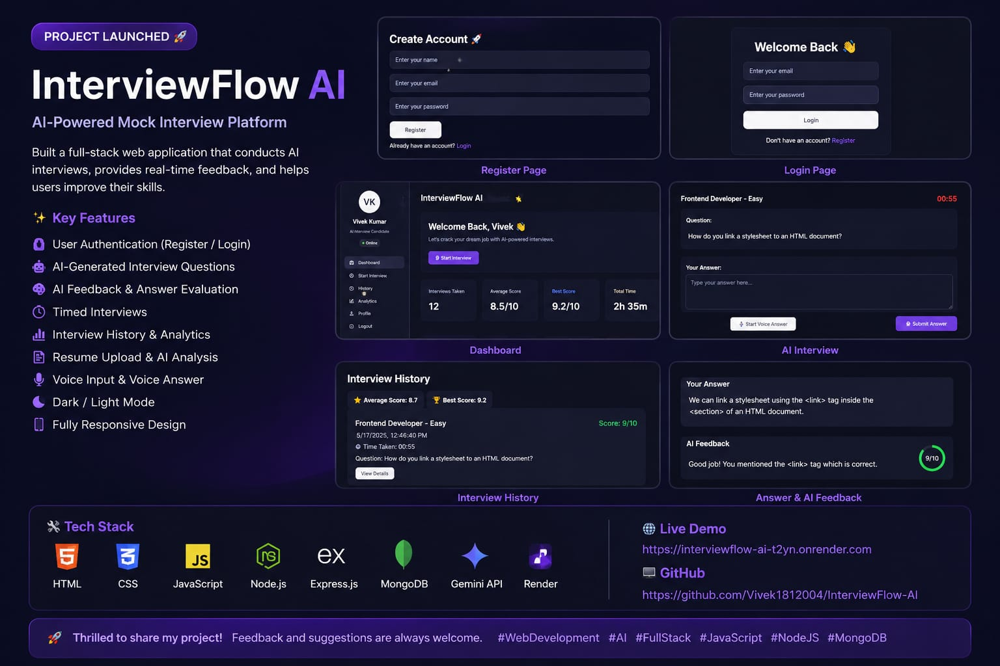

# 🚀 InterviewFlow AI

InterviewFlow AI is a full-stack AI-powered mock interview platform.

## 🌐 Live Demo
https://interviewflow-ai-t2yn.onrender.com

---

## ✨ Features

- 🔐 User Authentication
- 🤖 AI Interview Questions
- 🧠 AI Feedback System
- ⏱️ Interview Timer
- 🎤 Voice Input
- 🔊 Speak Question
- 📊 Analytics Dashboard
- 📁 Interview History
- 📄 Resume Analysis
- 🌙 Dark / Light Mode
- 📱 Mobile Responsive

---

## 🛠️ Tech Stack

### Frontend
- HTML
- CSS
- JavaScript

### Backend
- Node.js
- Express.js

### Database
- MongoDB Atlas

### AI
- Gemini API

### Deployment
- Render

---

## 📸 Screenshots



---

## ⚡ Installation

```bash
npm install
node server.js